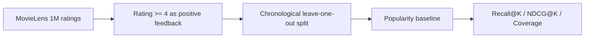

# Two-Stage Movie Recommendation System

使用 MovieLens 1M 真实评分数据构建的推荐算法项目。当前第一阶段完成了可复现的数据下载、时间切分、热门推荐基线和 Top-K 离线评估；后续模型必须与该基线在同一测试集上比较。

## 为什么先做基线

复杂模型并不自动代表更好的推荐。热门推荐提供一个低成本、可解释的参照；如果 ALS 或排序模型不能稳定超过它，就不能声称算法有效。

## 当前流程



关键设计：

- 数据源：[GroupLens MovieLens 1M](https://grouplens.org/datasets/movielens/1m/)
- 将评分不低于 4 的记录定义为正反馈
- 每名合格用户的最后一次正反馈只用于测试
- 推荐时排除用户已经交互过的电影
- 使用 `Recall@K`、`NDCG@K` 和目录覆盖率评估
- 不把离线指标描述成线上点击率或业务收益

## 第一阶段真实结果

以下结果由 `scripts/run_baseline.py` 在完整 MovieLens 1M 数据上生成，原始报告保存在 `reports/baseline_metrics.json`：

| 指标 | 结果 |
| --- | ---: |
| 原始评分 | 1,000,209 |
| 正反馈交互 | 575,281 |
| 可评估用户 | 6,037 |
| Recall@10 | 0.0389 |
| NDCG@10 | 0.0193 |
| Catalog coverage | 3.29% |

这些数值只代表时间留一测试集上的热门推荐基线。较低的覆盖率说明热门模型集中推荐少量电影，也为后续个性化模型提供了明确的改进目标。

## 运行

```powershell
python -m venv .venv
.\.venv\Scripts\python.exe -m pip install -r requirements.txt
.\.venv\Scripts\python.exe scripts\run_baseline.py
```

命令会从 GroupLens 下载 MovieLens 1M，并将实际结果写入 `reports/baseline_metrics.json`。原始数据位于 `data/`，不会提交到 GitHub。

## 测试

```powershell
.\.venv\Scripts\python.exe -m unittest discover -s tests -v
```

测试覆盖：

- 评分阈值转换
- 按时间留出最后一次交互
- 训练集与测试集无交互泄漏
- 推荐结果排除已看电影
- Recall、NDCG 和覆盖率计算

## 后续阶段

1. 使用隐式反馈 ALS 或 BPR 完成候选召回。
2. 构造用户、电影和交叉特征。
3. 使用排序模型对候选集进行重排。
4. 在完全相同的时间测试集上比较所有模型。
5. 增加冷启动、长尾覆盖和分用户活跃度分析。

当前仓库处于基线阶段，不声称已经完成二阶段推荐模型。
