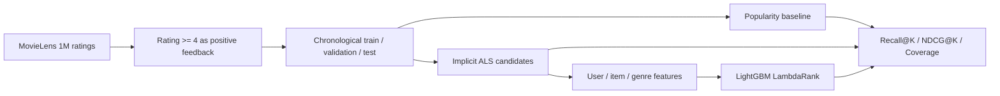

# Two-Stage Movie Recommendation System

[](https://github.com/tfy20030726-spec/movie-recommendation-system/actions/workflows/ci.yml)

使用 MovieLens 1M 真实评分数据构建的推荐算法项目。项目覆盖热门基线、隐式反馈 ALS 召回、候选特征工程和 LightGBM 排序，并完整保留没有超过 ALS 的排序实验结果。

## 为什么先做基线

复杂模型并不自动代表更好的推荐。热门推荐提供一个低成本、可解释的参照；如果 ALS 或排序模型不能稳定超过它，就不能声称算法有效。

## 当前流程



关键设计：

- 数据源：[GroupLens MovieLens 1M](https://grouplens.org/datasets/movielens/1m/)
- 将评分不低于 4 的记录定义为正反馈
- 二阶段实验将每名合格用户的倒数第二次正反馈用于排序训练、最后一次只用于测试
- 排序训练用户再按固定规则拆分为拟合组和早停组
- 推荐时排除用户已经交互过的电影
- 使用 `Recall@K`、`NDCG@K` 和目录覆盖率评估
- 不把离线指标描述成线上点击率或业务收益

## 第一阶段真实结果

以下结果由 `scripts/run_baseline.py` 在完整 MovieLens 1M 数据上生成，原始报告保存在 `reports/baseline_metrics.json`：

| 指标 | 结果 |
| --- | ---: |
| 原始评分 | 1,000,209 |
| 正反馈交互 | 575,281 |
| 可评估用户 | 6,037 |
| Recall@10 | 0.0389 |
| NDCG@10 | 0.0193 |
| Catalog coverage | 3.29% |

这些数值只代表时间留一测试集上的热门推荐基线。较低的覆盖率说明热门模型集中推荐少量电影，也为后续个性化模型提供了明确的改进目标。

## ALS 召回结果

使用 64 个隐向量、20 次迭代和固定随机种子训练隐式反馈 ALS。完整配置与原始结果保存在 `reports/als_metrics.json`：

| 模型 | Recall@10 | NDCG@10 | Catalog coverage |
| --- | ---: | ---: | ---: |
| 热门推荐 | 0.0389 | 0.0193 | 3.29% |
| ALS | 0.0798 | 0.0390 | 42.73% |
| 绝对变化 | +0.0409 | +0.0198 | +39.44 pp |

在该固定时间测试集上，ALS 同时提高了命中能力、排序质量和目录覆盖率。它仍然只是离线实验，不能据此声称线上点击率或收入得到提升；当前参数也没有使用测试集进行搜索调优。

## 二阶段排序实验

ALS 为每名用户生成 100 个候选，排序器使用 ALS 分数、候选排名、电影热度、用户活跃度、类型亲和度和年代距离等特征。4,825 名用户用于拟合，1,206 名用户用于早停，冻结测试集包含 6,035 名用户。

完整结果保存在 `reports/reranker_metrics.json`：

| 模型 | Recall@10 | NDCG@10 | Catalog coverage |
| --- | ---: | ---: | ---: |
| ALS（同一三段切分） | 0.0701 | 0.0346 | 42.78% |
| ALS + LightGBM | 0.0674 | 0.0312 | 47.12% |
| 绝对变化 | -0.0027 | -0.0034 | +4.34 pp |

ALS 的候选召回率 `Recall@100` 为 39.24%，但当前排序器没有提高前 10 名的命中率和排序质量，只扩大了目录覆盖率。因此仓库不宣称二阶段模型优于 ALS。这个负结果说明简单的内容与热度特征不足以稳定改善协同过滤排序，也避免了只报告成功实验的选择性偏差。

## 运行

```powershell
python -m venv .venv
.\.venv\Scripts\python.exe -m pip install -r requirements.txt
.\.venv\Scripts\python.exe scripts\run_baseline.py
.\.venv\Scripts\python.exe scripts\run_als.py
.\.venv\Scripts\python.exe scripts\run_reranker.py
```

命令会从 GroupLens 下载 MovieLens 1M，并将实际结果写入 `reports/`。原始数据位于 `data/`，不会提交到 GitHub。

## 测试

```powershell
.\.venv\Scripts\python.exe -m unittest discover -s tests -v
```

测试覆盖：

- 评分阈值转换
- 按时间留出最后一次交互
- 训练、验证和测试三段时间顺序
- 训练集与测试集无交互泄漏
- 推荐结果排除已看电影
- ALS 推荐只返回训练目录中的未看电影
- 排序训练候选包含且仅包含一个验证正样本
- Recall、NDCG 和覆盖率计算

## 后续阶段

1. 分析排序器在用户活跃度、电影热度和类型上的分组表现。
2. 尝试多路召回，降低 ALS 候选阶段的上限约束。
3. 增加冷启动和长尾推荐策略。
4. 在不重复查看冻结测试集的前提下开发更强的交叉特征。
5. 增加一个只展示已验证结果的交互演示页面。

当前仓库已经完成可复现的二阶段实验，但排序器仍是需要改进的实验模型，不是生产推荐系统。
